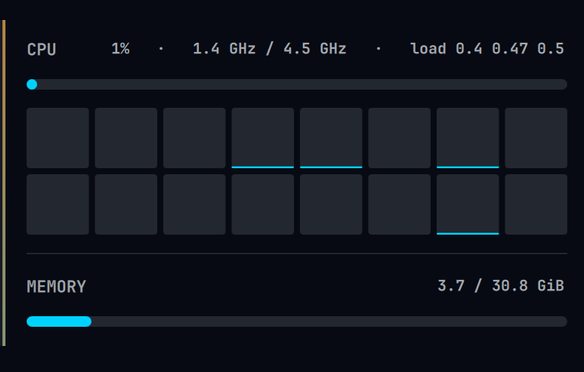

# omarchy-hwmon

A hardware-monitor widget for the [Omarchy](https://omarchy.org/) status bar
(Quickshell). Shows a live CPU / temperature readout in the bar and opens a
detailed system panel on click.



## Features

- **Compact bar readout:** `CPU%` + package temperature.
- **Right-click / scroll** toggles an expanded readout: adds `MEM%`, `GPU%`,
  `BAT%`. The choice is remembered across restarts.
- **Left-click** opens the detail panel:
  - CPU usage, frequency, load average, and a per-core bar grid
  - Memory and swap
  - Thermals and fan speeds
  - Per-GPU utilisation meters — AMD iGPU via `gpu_busy_percent` sysfs,
    NVIDIA via `nvidia-smi`
  - Disk usage per mount
  - Live network throughput per interface
  - Top processes by CPU and by RAM
  - Battery level and charge status
- Polls every 3 s (1.5 s while the panel is open).
- NVIDIA is only queried while the panel is open, so the background poll never
  wakes a dGPU that is asleep.

## Requirements

- Omarchy shell (Quickshell-based bar)
- `jq`, `lm_sensors` (`sensors`), coreutils (`free`, `df`, `nproc`, `ps`)
- Optional: `nvidia-smi` for NVIDIA GPU stats

## Install

```sh
omarchy plugin add https://github.com/GrootAiInfinity/omarchy-hwmon.git --enable
```

Adds the widget to the right side of the bar. Remove it with
`omarchy plugin remove groot.hwmon`, update with `omarchy plugin update groot.hwmon`.

### Optional: start expanded

```sh
omarchy plugin enable groot.hwmon   # if not already
```

then set `expanded` on the `groot.hwmon` entry in `~/.config/omarchy/shell.json`:

```json
{ "id": "groot.hwmon", "expanded": true }
```

(also toggled any time with right-click / scroll on the widget).

## Notes

- `hwmon.qml` resolves `hwmon.sh` by an absolute path
  (`~/.config/omarchy/bar/scripts/hwmon.sh`, hard-coded as `/home/<user>/…`).
  If your username isn't `groot`, edit the `script` / `stateFile` properties at
  the top of `hwmon.qml`.
- `omarchy update` / `omarchy refresh shell` rewrites `shell.json` and drops the
  `hwmon` layout entry (the widget files survive). Re-add the entry and
  `omarchy restart shell`.
- Custom `type: qml` modules don't appear in `omarchy-shell shell listPlugins`.

## License

MIT
